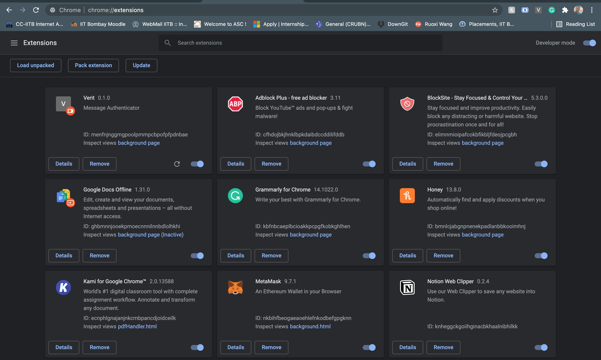
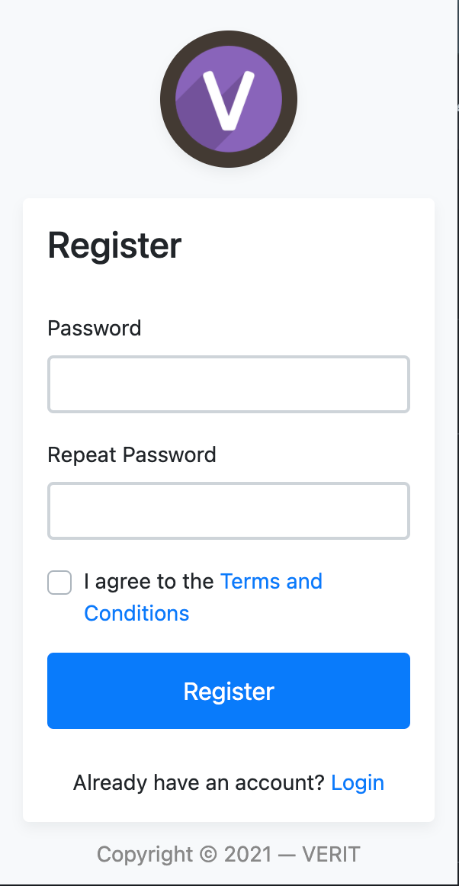
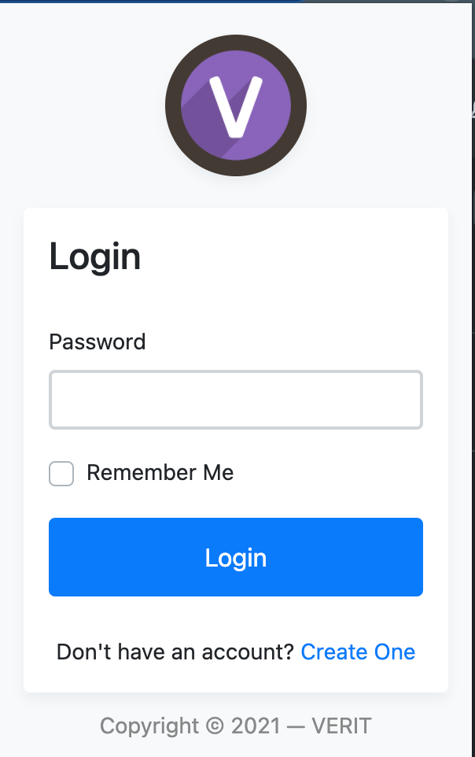
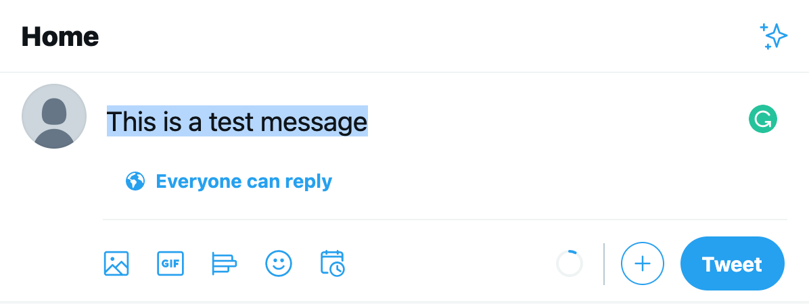
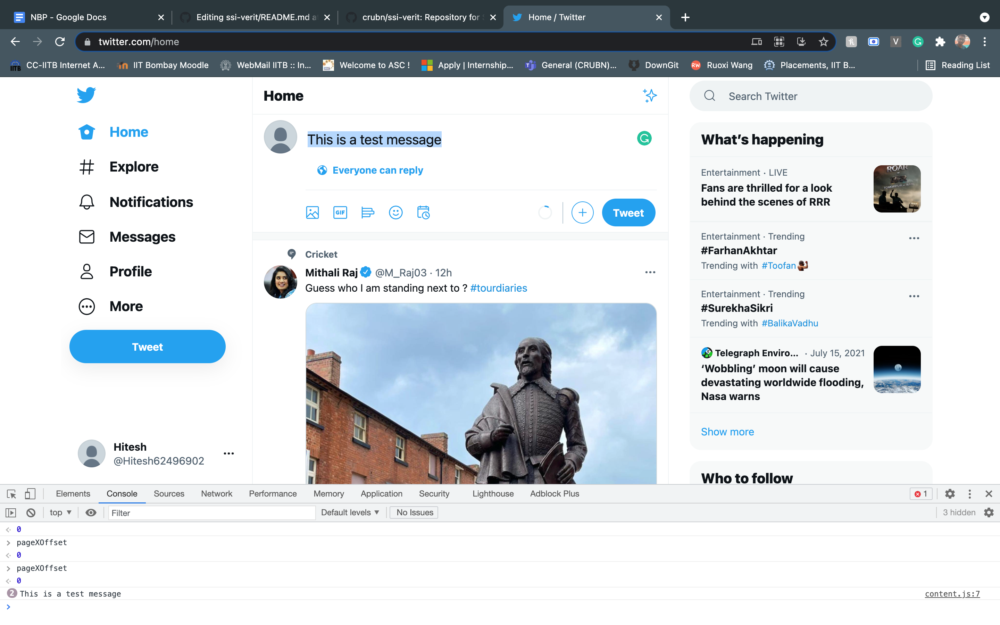
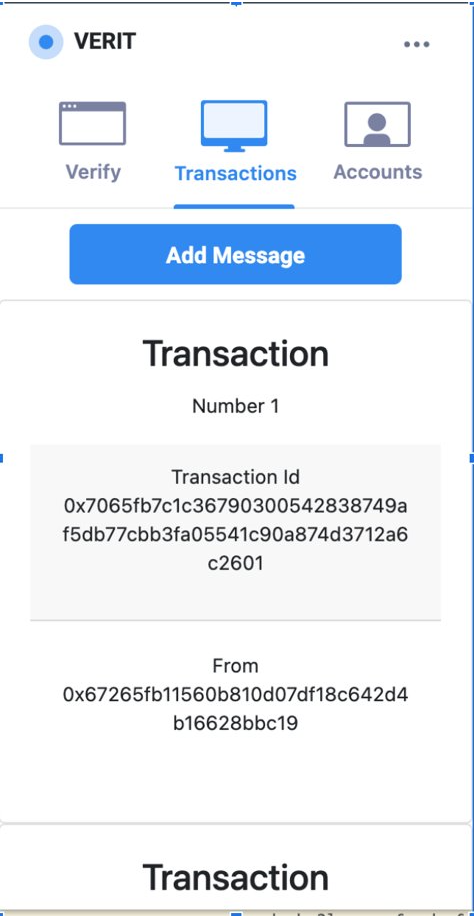
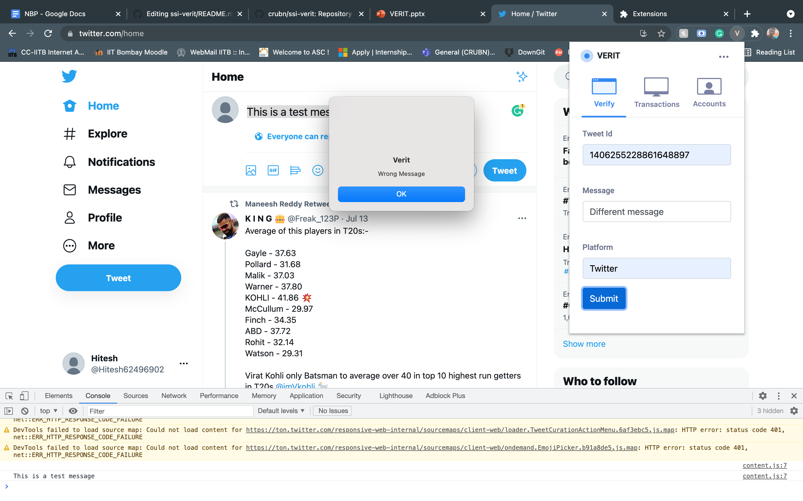
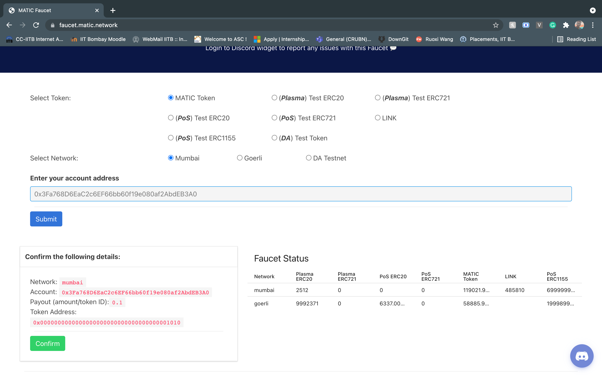

# SSI-Verit
Repository for SSI Verit project from Summer'21
## Loading your Chrome Extension:-

Step1:-
	Go to the link “chrome://extensions/ “ on your chrome browser.
<br />
<br />
Step2:-
	Select the developer mode on top right to your extension
<br />
<br />
Step3:-
	Click on the Load Unpacked option available 
<br />
<br />
Step4:- 
	Select the folder where you pulled/cloned this repository( Note that it contains the manifest.json script )
<br />
<br />

Now you can see your chrome extension in the available extensions.


## Instructions for Using this extension

```
Step1:-Signup in the chrome extension and Login through the password which you used.
```
<div style="display:flex">
  
  
</div>
<br \>

```
Step2:-Go to the website https://twitter.com/home and type the message you wanted to tweet, now select the message.
```



```
You can notice that this message is getting stored in the background scripts by going to the inspect section.
```



```
Step3:- Once you login to the extension you can see the "Add Message" Option in the transaction section once you
click that your message will be sent to smart contract as a transaction, which can be used for verification further.
```



```
Step4:- Using the verify section, here you need to add the Tweet Id, the message corresponding to the tweet id,
and the platform in which this is used.( For now we are hardcoring the value of Tweet Id as we are yet to figure 
out how to catch the tweet without intrevension of chrome extension ( i.e clicking the add message button ).
Hardcored Tweet Id-1406255228861648897 )
```


```
Once you click the submit button a alert will popup showing wether the message is correct or wrong.
```

<div style="display:flex">
  
  
</div>
<br />
<br />

**Note:- Whenever a account address is generated for the first time it need to contain some gas price in it so transactions can occur,
to add some test token you can visit the site https://faucet.matic.network/ and enter the account address there so tokens/test curency 
gets added into the account so transactions can occure. Notice that this steo need to done only once when a new account address is 
generated if this is not done then the error "insufficient funds for gas * price + value" will occur.**

<br />
<br />



```
Here on the content will be focusing how general chrome extension works and how to debugg it, and how to use Web3.js library,
how to interact with the smart contracts, how to deploy the smart contract.
```

## How Chrome Extension works.
It mainly has three components to interact with, and a manifest.json file is used to specify these respective fields.(Note that manifest.json is a must file and the naming of file should be same i.e manifest.json only)

**1)Content Script:-**(content.js)
<br />
	These files are used to interact with the content being displayed on  the screen.
 <br />
Ex:-
We replace all the words “Hi” on the screen with “Hello”. Or we can highlight the html paragraph type objects that are being displayed,etc …

**2)Background Script:-**(background.js)
<br />
 	These files are used to interact with the chrome application and the actions which are being performed on them.
<br />
Ex:-
The action of clicking for a new tab or changing the current tab, selecting an extension, etc…

**3)Popup Scripts:-**( in this repository login.js is used as popup script)
<br />
	These are basically the html files and javascript page that you use for  building a website, there are no differences.


**4)Manifest.json:-**
Here is an example file using this we explain the different components used in them.
```
{
    "name": "Verit",
    "description": "Message Authenticator",
    "version": "0.1.0",
    "manifest_version": 2,
    "content_scripts": [
        {
          "matches": [
            "<all_urls>"
          ],
          "js": ["content.js"]
        }
    ],
    "background": {
      "scripts": ["./background.js"]
    },
      "browser_action": {
    "default_popup": "login.html",
    "default_title": "VERIT-NEW"
    },
    "permissions": [
        "storage",
        "http://localhost:3000/"
    ],
    "content_security_policy": "script-src 'self' 'unsafe-eval' https://cdn.jsdelivr.net/npm/@maticnetwork/maticjs@latest/dist/matic.js    https://cdn.jsdelivr.net/gh/ethereum/web3.js@1.0.0-beta.36/dist/web3.min.js https://cdn.jsdelivr.net/gh/ethereum/web3.js/dist/web3.min.js ; object-src 'self'"

}
```

<br />

The fields which we’ll be working/developing on are:-
1)content_scripts:- The content scripts which were discussed previously are to be mentioned here.
2)background:- The background scripts will be included here.
3)browser_action:- This is where we’ll be mentioning our popup scripts. As the name implies we will describe different scripts which will be displayed once we click on the chrome extension button.
4)Conten_security_policy: If you are using libraries from webpages in your html files, then you need to include them here( Note:- each link is separated by space not “,” ).
5)permissions:- If you are using any local storage of your PC in the script or any kind of permissions then you need to mention them here.

## Debugging the chrome Extension
The console for content script can be viewed by using the Inspect option of the screen directly. When you click the your extension icon you will be able to see the popup, now hover over the popup and do a right click then you can see the inspect option, which is used as a console for popup scripts. Now coming to the background scripts, when you load your chrome extension in “chrome://extensions/” there will be some text available beside your extension there you’ll be able to see a “background page” option once you click on that you’ll be redirected to the background console window( you can refer to the diagram added at the start).

## Interacting with Web3.js Library
It is used to interact with different blockchain platforms, it is mainly used for building DAPP’s ( Decentralised applications ). 
Web3.eth provides us many functionalities of the ethereum node/network.
<br />
Examples:-
<br />
1.web3.eth.accounts :- get’s the account address of all accounts connected to the ethereum node.
<br />
2.web3.eth.wallet:- creates a wallet where we can store multiple account addresses.
....etc.
<br />
For detailed set of functionalities and explanation refere to the following link [Web3](https://web3js.readthedocs.io/en/v1.2.11/web3.html)

Matic Network :- It is a network/platform similar to ethereum where we can sign transactions

## Interacting with smart contracts
```
    const VeritTraceRecords = require('./contracts/build/contracts/VeritTraceRecords.json');
    const VeritIdentityTable = require('./contracts/build/contracts/VeritIdentityTable.json');
    const maticweb3 = new Web3(new Web3.providers.HttpProvider('https://rpc-mumbai.maticvigil.com'));
    console.log(maticweb3);

    const contract = new maticweb3.eth.Contract(
        VeritIdentityTable.abi,
        '0xD86A4b3021c4095397A9923e99F728943925CBe8'
    );
    const record_contract = new maticweb3.eth.Contract(
        VeritTraceRecords.abi,
        '0xA18d955d14B6F618156b358533D43C2E4e763789'
    );
    var result =  await contract.methods.registerAddress("User", [], sign).send({from: address2, gas:100000 });
    const new_result = await record_contract.methods.addRecord(record).send({from: address2, gas:1000000 });
    const output = await record_contract.methods.verifyRecord(dataIndexHash,inputMessage,platformIdentifier).call({from: address2, gas:1000000 });
```

1. First you need to call the json interface of the smartcontract ( i.e json file )
2. You need to get the address where the contract is deployed and the "abi" of the smart contract to create an instance to call the functions.
3. send function allows us send the transaction to smart contract deployed on remote node in the network
4. call function allows to recieve the data from the deployed smart contract 
( Note:- whenever you are using call or send functions some "gas:----" amount should be specified so the transaction occurs )
<br />

Refer to the following tutorial to get clarity on how to use  [Smart Contracts](https://www.youtube.com/watch?v=2TV0r94p8OY&list=PLbbtODcOYIoFs0PDlTdxpEsZiyDR2q9aA&t=0s)

<br />

 Refer to the following tutorial to get clarity on how to use [Blockchain Nodes](https://www.youtube.com/watch?v=6AwfOJCZmVU)

## Using Truffle
Using truffle we can monitor the transaction that are being performed on a particaular node in the blockchain network and It particularly helps in debugging the code ( to check whethere transactions are happeing properly or not ) and Truffle can also be used to generate a new local node to work on.
Refer to the following tutorial video to get clarity on how to use [Truffle](https://www.youtube.com/watch?v=CgXQC4dbGUE)

## Metamask
MetaMask is a software cryptocurrency wallet used to interact with the Ethereum blockchain. It allows users to access their Ethereum wallet through a browser extension or mobile app, which can then be used to interact with decentralized applications. 
Steps to install Metamask are available here [Metamask](https://chrome.google.com/webstore/detail/metamask/nkbihfbeogaeaoehlefnkodbefgpgknn?hl=en)

<br />

**Note:-** For some more ideas redarding this extension refer the file [Ideas](./ideas.md)

<br />

## Resources
Here are some additional recources pertaining to  how to use Web3.js and truffle,how to build chrome extensions, and how to debug some frequent errors in chrome extensions, and how to use angular or react.js in building the chrome extension.

1. https://www.youtube.com/results?search_query=building+chrome+extension+with+angular+
2. https://www.youtube.com/watch?v=jf8HVUFPYHA
3. https://www.youtube.com/watch?v=qOx11D3CqPk
4. https://developer.chrome.com/docs/extensions/mv3/getstarted/
5. https://www.youtube.com/watch?v=Ipa58NVGs_c
6. https://medium.com/angular-in-depth/chrome-extension-with-angular-why-and-how-778200b87575
7. https://ashwinsathianwrites.wordpress.com/2019/03/24/setting-up-your-new-mac-for-mean-stack-development/
8. https://ashwinsathianwrites.wordpress.com/2019/03/26/how-to-install-bootstrap-styles-on-your-angular-project/
9. https://stackoverflow.com/questions/49699067/property-has-no-initializer-and-is-not-definitely-assigned-in-the-construc
10. https://stackoverflow.com/questions/39668731/what-typescript-version-is-visual-studio-code-using-how-to-update-it
11. https://code.visualstudio.com/docs/typescript/typescript-compiling#_using-newer-typescript-versions
12. https://github.com/surajondev/extension-calculator
13. https://web3js.readthedocs.io/en/v1.2.6/#:~:text=Ethereum%20JavaScript%20API-,web3.,a%20HTTP%20or%20IPC%20connection.&text=js%2C%20as%20well%20as%20providing%20a%20API%20reference%20documentation%20with%20examples.
14. https://www.dappuniversity.com/articles/web3-js-intro
15. https://www.toptal.com/nodejs/why-the-hell-would-i-use-node-js
16. https://github.com/starkbank/ecdsa-python
17. https://pypi.org/project/ecdsa/
18. https://www.youtube.com/watch?v=_ATi4A5Bl1s
19. https://sebhastian.com/javascript-require-is-not-defined/
20. https://ethereum.stackexchange.com/questions/73846/problem-connecting-web3-v-1-2-1-with-metamask-currentprovider-of-undefined/73874#73874
21. https://stackoverflow.com/questions/48104433/how-to-import-es6-modules-in-content-script-for-chrome-extension
22. https://stackoverflow.com/questions/34950009/chrome-extension-refused-to-load-the-script-because-it-violates-the-following-c
23. http://remix.ethereum.org/#optimize=false&runs=200&evmVersion=null&version=soljson-v0.8.1+commit.df193b15.js
24. https://stackoverflow.com/questions/60255403/interacting-with-metamask-web3-js
25. https://stackoverflow.com/questions/66636403/manifest-v3-resources-must-be-listed-in-the-web-accessible-resources/66638224#66638224
26. https://stackoverflow.com/questions/46869780/access-global-js-variables-from-js-injected-by-a-chrome-extension/46870005#46870005
27. https://github.com/jakubsta/example-extension
28. https://github.com/ChainSafe/web3.js/issues/1513
29. https://ethereum.stackexchange.com/questions/24266/elegant-way-to-detect-current-provider-int-web3-js
30. https://courses.blockgeeks.com/question/web3-eth-contract-is-not-a-constructor/
31. https://www.youtube.com/watch?v=n9QLsSagUzE
32. https://www.youtube.com/watch?v=LzdMosLzj80
33. https://www.youtube.com/watch?v=4cPEGO4NAao&list=PLbbtODcOYIoFs0PDlTdxpEsZiyDR2q9aA&index=6
34. https://www.youtube.com/watch?v=xChKky8kb6A&list=PLbbtODcOYIoFs0PDlTdxpEsZiyDR2q9aA&index=6
35. https://www.youtube.com/watch?v=xFOb8sGNrEQ&list=PLbbtODcOYIoFs0PDlTdxpEsZiyDR2q9aA&index=7
36. https://www.youtube.com/watch?v=8K4Wt37Itc4&t=0s
37. https://www.youtube.com/watch?v=ShbHwaiyOps
38. https://github.com/letorbi/tarp.require
39. https://stackoverflow.com/questions/22344885/multiple-background-scripts-in-a-google-chrome-extension#:~:text=A%20background%20page%20will%20be,scripts%22%3A%20%5B%20%22background.
40. https://scotch.io/@dongido/how-to-build-a-google-chrome-extension


